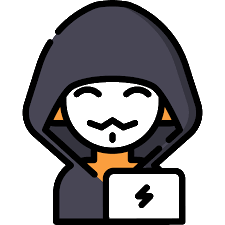

<h1 align="center">Hi 👋, I'm Sergio</h1>
<h3 align="center">🌟FullStack Developer🌟</h3>

 

- 🌱 I’m currently learning Web Development and other programming languages for funny and entertaiment

- 📫 How to reach me **sergiofuentes566@gmail.com**

- ⚡ Food and Music🎵 are the reasons to live.

 
<h3 align="center">Connect with me:</h3>

 

<h3 align="center">Languages and Tools:</h3>

<!-- HTML-->
 </a>
<!-- CSS3 -->
 </a>
<!-- SASS -->
 </a>
<!-- BootStrap -->
 </a>
<!-- Babel -->

</a>
<!-- Materialize -->
 </a>
<!-- JavaScript -->
 </a>
<!-- TypeScript -->
 </a>
<!-- Node.js -->
 </a>
<!-- React -->
 </a>
<!-- Next.js-->
 </a>
<!-- Jest -->
</a>
<!-- Arduino -->
 </a>
<!-- Electron -->
 </a>
<!-- Express -->

</a>
<!-- Cypress -->
 </a>
<!-- Flutter -->

</a>
<!-- FireBase -->

</a>
<!-- Docker -->
 </a>
<!-- Webpack -->
 </a>
<!-- Postman -->

</a>
<!-- Git -->

<!-- MongoDB -->
 </a>
<!-- MySql -->
 </a>
<!-- Php -->
 </a>
<!-- Python -->
 </a>
<!-- C -->
 </a>
<!-- C++ -->
 </a>
<!-- C# -->
 </a>
<!-- Java -->
 </a>
<!-- Figma -->
 </a>
<!-- Kotlin -->

</a>

<h3 align="center">Statistical Data</h3>

 
<table align="center" border="0">
<tbody>
<tr>
<td>

</td>
<td>

</td>
</tr>
</tbody>
</table>
