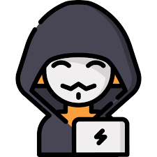

<h1 align="center">Hi 👋, I'm Sergio</h1>
<h3 align="center">🚀 Full Stack Developer | Web & App Development</h3>

I build modern web and mobile applications with a strong focus on clean code, performance, and user experience.

  

<i>Code, creativity & coffee ☕</i>

 

🌱 Currently focused on <b>Full Stack Web Development</b> and constantly learning new technologies.

📫 Contact me at: <b>kroquetita@gmail.com</b>

⚡ Music 🎵 and good food 🍔 keep me inspired.

 

<h3 align="center">🌐 Connect with me</h3>

 

<h3 align="center">🛠️ Languages & Tools</h3>

<b>Frontend</b>

<b>Backend</b>

<b>Mobile</b>

<b>Tools & DevOps</b>

 

<h3 align="center">📊 GitHub Streak Stats</h3>

 

<table align="center">
<tr>
<td>

</td>
<td>

</td>
</tr>
</table>

 
